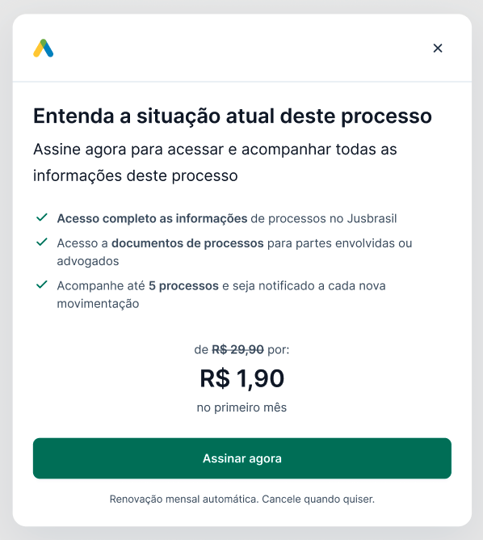

# Mock API

Este projeto é um mock de uma API usando Express.js, construído em Node.js e Docker.

## Requisitos

- **Docker**: Certifique-se de que o Docker está instalado em sua máquina.
- **Docker Compose**: Para orquestrar o contêiner Docker.

## Como rodar a aplicação

Siga os passos abaixo para rodar o projeto em seu ambiente local usando Docker.

### Passo 1: Clone o repositório

Clone o repositório para o seu ambiente local:

```bash
git clone <link-do-repositorio>
cd <nome-do-repositorio>
```

### Passo 2: Construir e rodar o contêiner Docker

Dentro da pasta do projeto, execute o comando abaixo para construir a imagem Docker e iniciar o contêiner:

```bash
docker-compose up --build
```

Isso irá:

- Construir a imagem Docker usando o `Dockerfile`.
- Instalar as dependências necessárias.
- Iniciar o servidor Node.js.

A aplicação estará rodando no endereço: `http://localhost:9777`.

### Passo 3: Acessar a API

Uma vez que o contêiner esteja em execução, você pode acessar as seguintes rotas disponíveis:

#### Rota `GET /box-lock`

Ela retorna as informações de oferta para o usuário, caso ele deseja fazer um upgrade para utilizar
as funcionalidades da página.

```
http://localhost:9777/box-lock
```

A resposta será um JSON formatado com as informações:

```json
{
  "header": {
    "title": "Entenda a situação atual deste processo",
    "subtitle": "Assine agora para acessar e acompanhar todas as informções deste processo"
  },
  "body": {
    "benefits": [
      "Acesso completo as informações de processos no Jusbrasil",
      "Acesso a documentos de processos para partes envolvidas ou advogados",
      "Acompanhe até 5 processos e seja notificado a cada nova movimentação"
    ],
    "price": {
      "current": "R$ 1,90",
      "next": "R$ 29,90",
      "period": "primeiro mes"
    },
    "button": {
      "label": "Assinar agora"
    }
  },
  "footer": {
    "text": "Renovação mensal automática. Cancele quando quiser."
  }
}
```

Você deve usar esse `JSON` para preencher essa modal abaixo.



#### Rota `GET /experiment/participate`

Ela retorna informações do experimento que o usuário foi sorteado para participar. Esses dados
serão importantes para decidir o que ele irá visualizar, de acordo com a alternativa escolhida
para ele.

```
http://localhost:9777/experiment/participate
```

A resposta será um JSON formatado com as informações:

```json
{
  "alternative": {
    "name": "control"
  },
  "client_id": "a8f0a7cd-ab76-4fa1-9294-7aac653010d9",
  "experiment": {
    "name": "litigants-experiment"
  },
  "experiment_group": {
    "name": "justarter"
  },
  "participating": true,
  "simulating": false,
  "status": "ok"
}
```

Além disso você pode forçar um cenário que o usuário está participando de uma determinada alternativa, caso
precise testar algum cenário, por exemplo, o usuário ser sorteado em uma variante específica:

```
http://localhost:9777/experiment/participate?alternative=variant-a&simulating=true
```

E assim a resposta vai trazer os dados como se ele foi selecionado:

```json
{
  "alternative": {
    "name": "variant-a"
  },
  "client_id": "a8f0a7cd-ab76-4fa1-9294-7aac653010d9",
  "experiment": {
    "name": "litigants-experiment"
  },
  "experiment_group": {
    "name": "justarter"
  },
  "participating": false,
  "simulating": true,
  "status": "ok"
}
```

## Como parar a aplicação

Para parar a execução da API, use o seguinte comando:

```bash
docker-compose down
```

Esse comando irá parar e remover o contêiner.

## Estrutura do projeto

- `Dockerfile`: Arquivo Docker que contém as instruções para criar a imagem do Node.js e rodar a aplicação.
- `docker-compose.yml`: Arquivo de configuração do Docker Compose para orquestrar o contêiner.
- `index.mjs`: Arquivo principal da aplicação, que define a rota e a lógica da API.
- `src/mocks/box-lock.mjs`: Mock de dados para a rota `/box-lock`.
- `package.json`: Contém as dependências do projeto e os scripts para rodar a aplicação.
